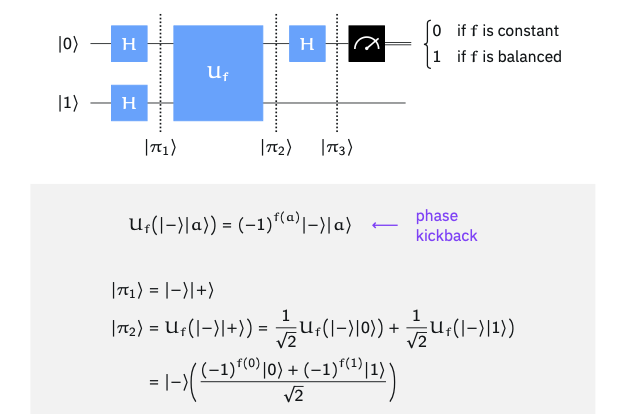

# Deutsch's Algorithm

## Step 1: Prepping the "Trap"
We start with two qubits. We set the Top Qubit to $\vert{}0\rangle$ and the Bottom Qubit to $\vert{}1\rangle$.

## Step 2: Going into Superposition (The H Gates)
We blast both qubits with an H Gate (Hadamard).

* The Top Qubit becomes a friendly, equal blend of both choices: $(0 + 1)$.
* The Bottom Qubit becomes a subtraction blend: $(0 - 1)$. (This minus sign is a hidden trap card for the black box!)

## Step 3: Pushing into the Unitary Gate
We send this combined state into the Unitary black box. Because the top qubit is a superposition of $(0 + 1)$, the box evaluates both $f(0)$ and $f(1)$ at the exact same moment.
Now, remember how the box is wired to flip the bottom qubit if $f(x)=1$?
Because the bottom qubit is in a $(0 - 1)$ state, flipping its bits ($0 \leftrightarrow 1$) actually causes the entire mathematical wave to bounce and multiply by a minus sign ($-$). This is a quantum trick called the Phase Kickback.

* If the box is Constant ($f(0) = f(1)$): Both paths kick back the exact same sign. Nothing changes relatively. The top qubit stays a clean $(0 + 1)$.
* If the box is Balanced ($f(0) \neq f(1)$): Only one path kicks back a minus sign. This disrupts the peace! The top qubit gets altered by the kickback and turns into $(0 - 1)$.

Notice what just happened: The answer to the puzzle ($f(0)$ vs $f(1)$) has been secretly printed onto the top qubit's phase (whether it has a $+$ or a $-$ sign).

## Step 4: The Final H Gate (The Un-Superposition)
Right now, if you measure the top qubit, it is still a 50/50 blur. You can't see a phase sign directly in real life.
So, we hit the top qubit with a final H Gate. The H gate is its own opposite. It converts wave phases back into solid reality:

* An H gate turns $(0 + 1)$ directly back into a solid $0$.
* An H gate turns $(0 - 1)$ directly back into a solid $1$.

## Step 5: Measurement
Read the top qubit:
* If it reads 0, the box is Constant. The top qubit does not change (it goes in as a plus-phase state and comes out exactly the same, which the final H gate decodes as a 0).
* If it reads 1, the box is Balanced. The top qubit changes (it gets hit by the minus-sign kickback, transforming its phase, which the final H gate decodes as a 1).

By measuring whether the top qubit changed or stayed the same, you instantly know how the hidden black box was wired inside, all in a **single query**.

------------------------------
## Takeaway
* Initialize: Top qubit to $\vert{}0\rangle$, bottom qubit to $\vert{}1\rangle$.
* Superposition: Apply H gates to both qubits to create the wave.
* Query: Run through the Unitary Gate to trigger phase kickback.
* Decode: Apply a final H gate to the top qubit to convert phase back to data.
* Measure: Read the top qubit ($0 = \text{Constant}$, $1 = \text{Balanced}$).

