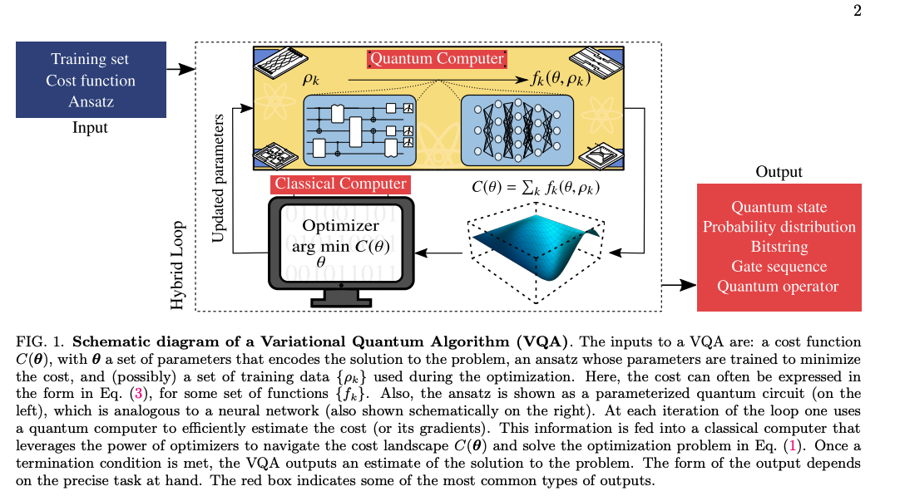

# Title: Variational quantum algorithms
Authors: M. Cerezo, Andrew Arrasmith, Ryan Babbush et al.  
Year:  2021     
Institute: Los Alamos National Laboratory, Google Quantum AI, and more  
Venue: Nature Reviews Physics  
Link:  https://arxiv.org/pdf/2012.09265    
Document: [2021_Cerezo_Review_arXiv](resources/papers_download/QO_2021_Cerezo_VQA_Review.pdf)  

## One-sentence summary
This paper provide an overview of the VQAs(Variational Quantum Algorithms), explaining how they works, identifying challenges in VQAs, and evaluating the potential of VQA to obtain quantum advantage.

*Notes*:
- classical computers - high computational cost for simulate quantum systems or solve large-scale linear algebra problems. (Abstract)
- current quantum computers have constraints - limited number of qubits, noise processes that limit circuit depth. (Abstract)
- VQA - use a classical optimizer to train a parametrized quantum circuit - address the challenge of current quantum devices. (Abstract)
  - has challenges like trainability, accuracy, and efficiency of VQAs (Abstract)

## Problem - claim
Current quantum devices are small and noisy, VQA's hybrid approach that combines with a classical optimizers is now the best solution on NISQ devices.

*Notes*:
-  with an exponential speedup over classical methods, quantum algorithms could factor numbers, simulate quantum systems, or solve linear systems of equations. (Intro)
- Constraints: limited numbers of qubits, limited connectivity of the qubits, and coherent
and incoherent errors that limit quantum circuit depth.(Intro)
- VQAs leverage the toolbox of classical optimization, since VQAs use **parametrized quantum circuits** to be run on the quantum computer, and then outsource the parameter optimization to a **classical optimizer**. This approach has the added advantage of keeping the quantum circuit depth **shallow** and hence mitigating noise, in contrast to quantum algorithms developed for the fault-tolerant era. (Intro)

## Motivation
Many important scientific problems are too expensive for even the best supercomputers to solve. Since fault-tolerant quantum devices are still years away, it is vital to maximize the utility of current NISQ resources for practical applications.

*Notes*:   
- Classical computers have high computational cost to solve large-scale problem or simulate quantum systems. Due to the limitations of current NISQ devices, VQAs that can make use of shallow quantum circuit and mitigate noise, becomes a promising solution before fault-tolerant quantum devices.
- Nevertheless, the true promise of quantum computers, speedup for practical applications, which is often called quantum advantage, has yet to be realized. Moreover, the availability of fault-tolerant quantum computers appears to still be many years... The key technological question is therefore how to make best use of today’s NISQ devices to achieve quantum advantage. Any such strategy must account for: limited numbers of qubits, limited connectivity of the qubits, and coherent and incoherent errors that limit quantum circuit depth. (Intro)

## Evidence - support the claim
One of the evidences is using VQE to estimate eigenstate and eigenvalues of a given Hamiltonian. Unlike previous adiabatic state preparation and quantum phase estimation quantum algorithms that require hardware beyond current reach, the variational quantum eigensolver (VQE) provides a near-term solution. 
The other evidence is using VQE to simulate the dynamical evolution of a quantum system. Conventional approach like Trotter-Suzuki product formation, the circuit depth grows polynomially with the system size, VQAs only use a shallow circuit depth.  
Others like using a VQA to solve a classical optimization problem - QAOA.

*Notes*:
-  Current state-of-the-art device size ranges from 50 to 100 qubits which allows one to achieve ‘quantum supremacy’: outperforming the best classical supercomputer, for certain contrived mathematical tasks. (Intro)
-  There are many different applications of VQAs: error correction, compilation, machine learning, new frontiers like quantum info, quantum metrology, combinatorial optimization, dynamical simulations, finding ground states in quan chemistry and condensed matter, mathematical applications like factoring, systems of equations etc. (Figure 3)
-  Previous quantum algorithms to find the ground state of a given Hamiltonian H were based on adiabatic state preparation and quantum phase estimation subroutines [104, 105], both of which have circuit depth requirements beyond those available in the NISQ era. Hence, the first proposed VQA, the Variational Quantum Eigensolver (VQE), was developed to provide a near-term solution to this task. (Applications)
-  Apart from static eigenstate problems, VQAs can also be applied to simulate the dynamical evolution of a quantum system. Conventional quantum Hamiltonian simulation algorithms, such as the Trotter-Suzuki product formula [117], generally discretize time into small time steps and simulate each time evolution with a quantum circuit. Therefore, the circuit depth generally increases polynomially with the system size and simulated time.
Given the noise inherent in NISQ devices, the accumulated hardware errors for such deep quantum circuits can prove prohibitive. To address this, VQAs for dynamical quantum simulation only use a shallow depth circuit, significantly reducing the impact of hardware noise. (Applications)
- The most famous VQA for quantum-enhanced optimization is the QAOA [23], originally introduced to approximately solve combinatorial problems such as Constraint-Satisfaction (SAT) [127] and Max-Cut problems [128]. (Applications)

## Questions - weaken

*Notes*:  
- challenges remain including the trainability, accuracy, and efficiency of VQAs. (Abstract)

## Notes-taken

  
Basic concepts and tools & Applications:  
- The trademark of VQAs is that they use a quantum computer to estimate the cost function C(θ) (or its gradient) while leveraging the power of classical optimizers to train the parameters θ.
- Main advantage of VQAs: 
  - provide a **general framework** that can be used to solve a variety of problems.
    - Building blocks of VQAs:
      - Define a cost/loss function that encodes the solution to the problem.
      - Propose an ansatz, that is, a quantum operation depending on a set of continuous or discrete parameters that can be optimized. 
      - Train the ansatz in a hybrid quantum-classical loop to solve the optimization task.
  - Allows for **task-oriented programming**.  
- Applications:
  - Finding ground and excited states
    - Variational quantum eigensolver
    - Orthogonality constrained VQE
    - Subspace expansion method
    - Subspace VQE
    - Multistate contracted VQE
    - Adiabatically assisted VQE
    - Accelerated VQE
  - Dynamical quantum simulation
    - Iterative approach
    - SUbspace approach
    - Variational fast forwarding
    - Simulating open systems
  - Optimization
    - QAOA
  - 
Outlook section:   
- Better methods to analyze VQA scalability, including gradient scaling and other scaling aspects, such as the density of local minima and the shape of the cost landscape. 
- Better application specific ansatzes will enhance gradient magnitudes to improve trainability, and reduce the impact of noise on VQAs, include adaptive ansatz strategies. Hybrid quantum-classical models.
- New error mitigation strategies to improve accuracy. 
- Better quantum hardware - qubit count and noise levels. 
- VQAs are not only important during current NISQ era, can also be useful in the fault-tolerant era. Transitioning from estimating expectation values from Hamiltonian averaging to phase estimation. QAOA is a good candidate to find usage in the fault tolerant era. Strategies address challenges in NISQ (keep shallow circuit depth, avoid barren plateaus) can still be useful later on. 

## Some related papers/ papers mentioned

### Related contents from other paper

## Interesting 
